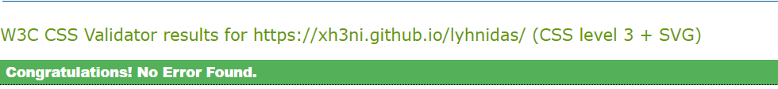

# Lyhnidas

Lyhnidas is an online course center for foreign languages, such as English, Albanian and German. It is based on Nürnberg, Germany.

This website targets all people interested on learning a new language. It provides new clients with business information, customer testimonials, and various services on offer.

## Contents

* [Features](#features)
  * [Navigation Bar](#navigation-bar)
  * [Landing Page](#landing-page)
    * [Hero Image](#hero-image)
    * [About Us](#about-us)
    * [Testimonials](#testimonials)
  * [Courses](#courses-page)
    * [Hero Image](#hero-image)
    * [Our Courses](#courses)
  * [Sign Up Page](#signup-page)
    * [Sign Up Hero Image](#signup-hero-image)
    * [Sign Up Form](#signup-form)
  * [Footer](#footer)
* [Responsive Design](#responsive-design)
* [Wireframes](#wireframes)
* [Design](#design)
  * [Colours](#colours)
  * [Typography](#typography)
* [Testing](#testing)
  * [Manual Testing](#manual-testing)
  * [Validation](#validation)
  * [Bugs](#bugs)
* [Deployment](#deployment)
  * [Development process](#development-process)
* [Credits](#credits)
* [Acknowledgments](#acknowledgments)

## FEATURES  

### Navigation Bar 

- The navigation bar is the first element on all three pages. 

- It is fully responsive and includes the Dapper Lyhnidas Logo on the left and a page menu on the right.

- The logo is wrapped in a link and can be used to navigate to the homepage. 
  
- The navigation bar is identical on each page to allow for easy navigation from page to page across all devices.

- All the items in the page menu link to their respective page. 

- When hovered, the links become underlined and adopt the main colour of the page.

- On smaller screens, the menu is displayed below the logo.  

- On smaller screens, the menu is displayed below the logo.

### Landing Page  

#### Hero Image 

  
- The landing page features a full-width image displaying a group of students working on their laptops.
- The goal is to create the impression that Lyhnidas is very friendly place, where all can be part of it.
- This section introduces the user to the services provided by the business.

#### About Us   

- The about us section introduces Lyhnidas and its activities..
- It includes 3 images with corresponding text for each of them.

#### Testimonials  

- The testimonials section displays a slider with different opinions about the courses in Lyhnidas. 

### Courses 

#### Courses Hero Image

- The courses page use the same hero-image as the homepage.

#### Our Courses  

- In the courses section, the user can get information about the courses Lyhnidas offers. 
- There can find the level of the course, duration of the course, timetable and the price for each course-level. 

### Sign Up Page   

#### Sign Up Hero Image

- The sign up page features a hero image in the same style as the hero image on the landing page. This covers all pages.

#### Sign Up Form  

- The sign up form features inputs for the users' first name, last name, email address and telephone number. There are three radio buttons for the prefered course. 

- The submit button is placed at the bottom of the form.

- All the inputs utilise the 'required' attribute to ensure that all the inputs are filled with valid data before submission.

### Footer  

- The footer is the last element on all three pages and it is also fully responsive. 

- On the left, top is a smaller version of the Lyhnidas Logo, together with all the business information.

- On the right, a map indicates the exact location of the business in Nürnberg, DE. For the map is used iframe, for a better access to the map.

- At the bottom of the footer, the user can find links to four different social media websites. Each link opens in a new tab.

## Responsive Design 
- The website uses media queries to optimise the available space on different screen sizes.
- The layout utilises Grid for responsiveness.

## Wireframes  

Wireframes were created for the mobile and desktop version of the website with the Program [Balsamiq](https://balsamiq.com/).

[Image of the wireframes](assets/docs/wireframes/wireframes1.PNG)
[Image of the wireframes](assets/docs/wireframes/wireframes2.PNG)
[Image of the wireframes](assets/docs/wireframes/wireframes3.PNG)

## Design  

### Colours  

- The website uses a palette of three blue tones,  dgreenblue as the primary colour and white as the accent colour.

### Typography  
- For the page logo and headings is used the font Playfair Display
- For the menu and body, the font Andika was used.

## Testing   

### Manual Testing  
- I have tested the desktop and mobile version of the website with Chrome, Firefox and Edge on a Windows Computer.
- I have tested the mobile version with Chrome and Firefox on an android device. 
- I have tested the mobile version with Safari on an ios device.
- I have shared the website with multiple users to confirm the website functionality on different devices and to get feedback on their experience.
- I have tested all the internal and external links on the website.
- I have checked that the contact form requires valid inputs.

### Validation  
#### HTML  
     
There were no errors found on any page using the W3C HTML Validator.
#### CSS  
  
There were no errors found in the stylesheet using the W3C CSS Validator.
#### Lighthouse  
   
I used the Chrome Lighthouse tool to audit the website.

### Bugs  
#### Fixed Bugs  
- The slide at testimonials section didn't take the excat response for screen sizes.
- After changing the content size and paddings the slide showes as excpected.

#### Unfixed bugs  
There are no unfixed bugs.

## Deployment  

The site was deployed using GitHub pages. 

The steps to activate Github pages are as follows:
- Navigate to the settings tab in the GitHub repository.
- In the settings, navigate to the 'Pages' tab on the left of the page.
- In the 'Build and deployment' section, select 'Deploy from a branch' in the source dropdown.
- Select branch 'main' and click on 'Save'.

The live link can be found here: [Lyhnidas](https://xh3ni.github.io/lyhnidas/index.html)

### Development process

- I started the program and repository by scratch, without any template.  
- Then I regularly staged my changes using the command `git add .` and then committed the staged changes to my local repository using `git commit -m 'short descriptive message here'`. 
- Finally, I would push the commits from my local repository up to the Github repository using the command `git push`.
- With every push, Github automatically deploys my latest commit from the 'main' branch to the Github pages.

## Credits  

- The hero-images used in the hero section are from [canva.com](https://www.canva.com/) and were edited and cut with Canva.
- All the images in the about-us, are from [Pixabay](https://pixabay.com/).
- The icons in the footer, about us, course and sig up section were taken from [FontAwesome](https://fontawesome.com/).
- The fonts are imported from [Google Fonts](https://fonts.google.com/).
- The favicon was generated using [favicon.io](https://favicon.io/).

## Acknowledgments

I would like to acknowledge the following people who have helped me along the way in completing my first milestone project:
- My mentor, Jubril Akolade, for his advices and encouragement.